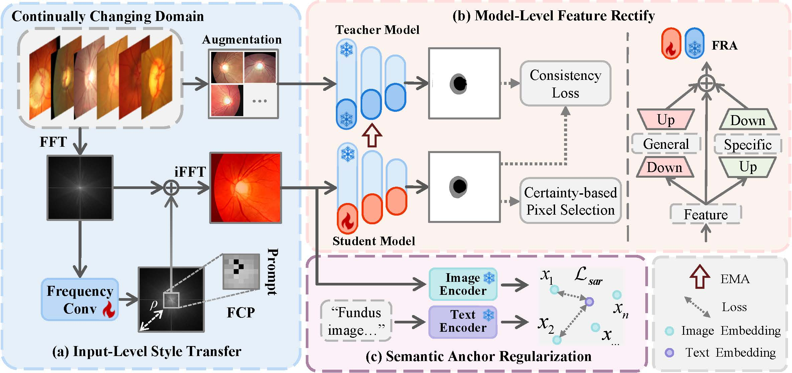

# DSATA: Dual-Level Semantically Aligned Continual Test-Time Adaptation for Medical Image Segmentation

This repository provides the official PyTorch implementation of **"DSATA: Dual-Level Semantically Aligned Continual Test-Time Adaptation for Medical Image Segmentation"** (MICCAI 2026 Submission, Anonymous).

## 📖 Overview  

DSATA is an architecture-agnostic continual test-time adaptation (CTTA) framework for medical image segmentation.  
Unlike conventional methods that rely solely on model updates or image-level style transfer, DSATA performs dual-level semantic alignment by jointly rectifying image appearance and model representations—without accessing source data during adaptation.

<div align="center">
  
</div>

## Environment

DSATA depends on
```
CUDA 10.1
Python 3.7.0
PyTorch 1.8.0
CuDNN 8.0.5
```

Installation:
```
pip install -r requirements.txt
```

## Data Preparation

The preprocessed data can be downloaded from Anonymous Drive link [OneDrive](https://1drv.ms/f/c/5d5242e0475b4e58/IgD9s0_0a3MtRIQOXIeoVGLdAfdNpQ2pCF8xKgghqRyzgpY?e=x7gf2U).

## Pre-trained Models

Download pre-trained models from [OneDrive](https://1drv.ms/f/c/5d5242e0475b4e58/IgCSbc56hkOZToPMCa1RiM_XAV9boduc53yXMMZUO9ZdbXU?e=1ksbxg) and drag the folder 'models' into the folder 'OPTIC' or 'POLYP'.

You can also train your own models from scratch following: [SegFormer](https://github.com/NVlabs/SegFormer)


## How to Run

Before running the experiments, please modify the dataset & model root paths in: `DSATA_OPTIC.sh` & `DSATA_POLYP.sh`

```
# Reproduce results on OD/OC segmentation
bash DSATA_OPTIC.sh

# Reproduce results on polyp segmentation
bash DSATA_POLYP.sh
```

<!-- ## Results

| Methods | DA (OD) | DB (OD) | DC (OD) | DD (OD) | DE (OD) | DA (OC) | DB (OC) | DC (OC) | DD (OC) | DE (OC) | Avg ↑ |
|----------|----------|----------|----------|----------|----------|----------|----------|----------|----------|----------|----------|
| No Adapt (Segformer-B5) | 75.12 | 82.76 | 77.57 | 84.02 | 71.55 | 55.34 | 66.10 | 57.01 | 70.91 | 49.86 | 69.02 |
| TENT | 78.71 | 84.89 | 84.22 | 86.45 | 72.26 | 69.26 | 73.05 | 73.79 | 72.30 | 51.27 | 74.62 |
| SAR | 82.62 | 85.32 | <u>87.72</u> | 87.28 | 82.26 | 72.62 | 74.98 | 75.19 | 73.83 | 58.79 | 78.06 |
| VPTTA | 79.41 | 83.86 | 82.01 | 82.01 | 75.32 | 68.41 | 73.86 | 69.01 | 71.01 | 61.37 | 74.63 |
| SicTTA | 80.03 | 81.75 | 81.50 | 84.94 | 84.94 | 69.80 | 79.67 | 68.32 | 74.80 | 69.61 | 77.54 |
| CoTTA | 82.58 | 88.64 | 86.89 | 88.63 | 77.74 | 76.37 | <u>79.92</u> | 78.76 | 76.65 | **78.10** | 81.43 |
| DLTTA | 84.93 | 87.90 | 87.60 | 87.81 | 84.51 | 77.05 | 78.26 | 77.38 | 75.05 | 67.79 | 80.83 |
| ViDA | 83.19 | 86.46 | 85.83 | <u>92.69</u> | <u>90.74</u> | **79.70** | 73.24 | <u>81.96</u> | <u>82.53</u> | 64.72 | <u>82.11</u> |
| GraTa | <u>86.27</u> | <u>89.11</u> | 86.83 | 89.30 | 79.50 | 76.19 | 79.83 | 77.36 | 79.89 | 73.74 | 81.80 |
| **DSATA (Ours)** | **87.73†** | **92.74†** | **90.29†** | **92.70†** | **91.14†** | <u>78.31†</u> | **83.00†** | **83.38†** | **83.98†** | <u>75.87†</u> | **85.91†** |

| Methods | A DSC | A Emax | A Sα | B DSC | B Emax | B Sα | C DSC | C Emax | C Sα | D DSC | D Emax | D Sα | Avg DSC ↑ | Avg Emax ↑ | Avg Sα ↑ |
|----------|----------|----------|----------|----------|----------|----------|----------|----------|----------|----------|----------|----------|----------|----------|----------|
| No Adapt | 79.80 | 87.97 | 84.32 | 74.23 | 85.04 | 82.02 | 79.50 | 88.32 | 84.78 | 82.30 | 90.58 | 87.90 | 78.96 | 87.98 | 84.76 |
| TENT | 72.11 | 81.75 | 79.70 | 67.84 | 80.84 | 78.09 | 74.51 | 86.50 | 80.62 | 80.71 | 90.21 | 86.54 | 73.79 | 84.83 | 81.24 |
| SAR | 78.11 | 86.59 | 83.26 | 76.07 | 85.40 | 82.84 | 79.65 | 88.82 | 84.40 | 81.31 | 90.60 | 87.28 | 78.79 | 87.85 | 84.44 |
| VPTTA | 84.96 | 91.68 | 87.59 | <u>81.89</u> | <u>90.29</u> | <u>86.81</u> | 82.40 | 90.24 | 86.65 | 82.49 | 90.96 | 88.02 | 82.94 | 90.79 | 87.27 |
| SicTTA | 83.55 | 90.74 | 86.67 | 80.02 | 89.21 | 85.33 | 81.70 | 89.63 | 86.28 | 83.03 | 91.03 | 88.20 | 82.07 | 90.15 | 86.62 |
| CoTTA | 83.78 | 90.70 | 86.99 | 76.49 | 86.64 | 83.49 | 82.43 | 90.16 | 86.73 | 82.23 | 90.59 | 87.73 | 81.23 | 89.52 | 86.24 |
| DLTTA | 82.83 | 90.32 | 86.12 | 77.45 | 87.68 | 83.92 | 80.57 | 88.54 | 85.84 | 81.23 | 89.49 | 87.48 | 80.52 | 89.01 | 85.84 |
| ViDA | 84.62 | 91.43 | 87.37 | 80.69 | 89.75 | 86.22 | 82.54 | 90.24 | 86.76 | <u>83.51</u> | <u>91.49</u> | <u>88.34</u> | 82.84 | 90.73 | 87.17 |
| GraTa | <u>85.29</u> | <u>92.01</u> | <u>87.74</u> | 81.14 | 89.82 | 86.43 | <u>83.08</u> | <u>90.77</u> | <u>87.04</u> | 83.08 | 91.35 | 88.20 | <u>83.15</u> | <u>90.99</u> | <u>87.35</u> |
| **DSATA** | **86.79†** | **93.10†** | **88.71†** | **83.20†** | **91.66†** | **87.50†** | **84.07†** | **91.84†** | **87.59†** | **84.45†** | **92.36†** | **88.80†** | **84.63†** | **92.24†** | **88.15†** | -->


## Contact (TODO)


## Acknowledgement

Parts of the code are based on the Pytorch implementations of [DLTTA](https://github.com/med-air/DLTTA), and [VPTTA](https://github.com/Chen-Ziyang/VPTTA).